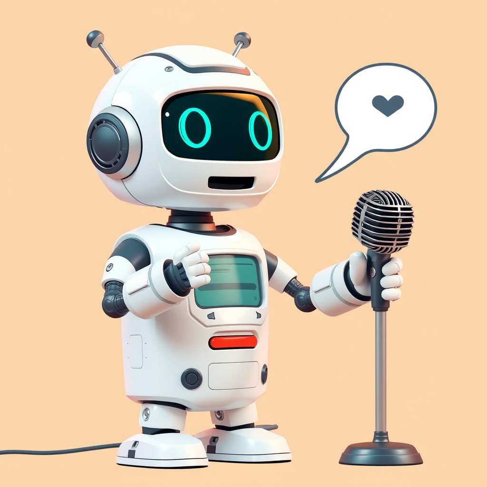

# Silicon Valley Generative AI meetup

We are focused on fostering learning, networking and career development of AI enthusiasts and practitioners around Silicon Valley.

#### 👉[Join us](https://lu.ma/svgenai){:target="_blank"} to be notified of future events. 
✉️  svgenai@gmail.com  
📽️  [videos](https://www.youtube.com/@svgenai)

## Organizers

**Dave Nielsen** 
Head of community, IBM / The AI Alliance, Dev community organizer 
[Linkedin](https://www.linkedin.com/in/dnielsen/){:target="_blank"} &nbsp; •  &nbsp; [Twitter/X](https://x.com/davenielsen){:target="_blank"}

**Sujee Maniyam** 
AI DevRel Engineer @ Nebius,  AI+Data Engineer, Dev community organizer 
[sujee.dev](https://sujee.dev/){:target="_blank"} &nbsp; •  &nbsp; [Linkedin](https://www.linkedin.com/in/sujeemaniyam/){:target="_blank"} &nbsp; •  &nbsp; [github](https://github.com/sujee/){:target="_blank"} &nbsp; •  &nbsp; [Twitter/X](https://x.com/sujee_dev/){:target="_blank"} &nbsp; •  &nbsp; [bsky](https://bsky.app/profile/sujee.dev){:target="_blank"}

**John Varghese** 
Principal Devops Engineer at DNAnexus, AWS Hero,  Dev community organizer 
[Linkedin](https://www.linkedin.com/in/jvaws/){:target="_blank"}

## Contact Us

Want to speak at our meetup (we are always looking for great speakers!) or sponsor us?

Contact us via email  or one of our organizers above.

✉️ : svgenai@gmail.com

## Meetups

| Date       | Location   | Topics | Link |
|------------|------------|-------|------|
|  2025 Jun 26          |    Fremont, CA        |  Langflow, MCP      |   [link](meetups/2025-06-26.md)   |
|  2025 May 01          |    San Jose, CA        |  AI Powered Engineer      |      |

